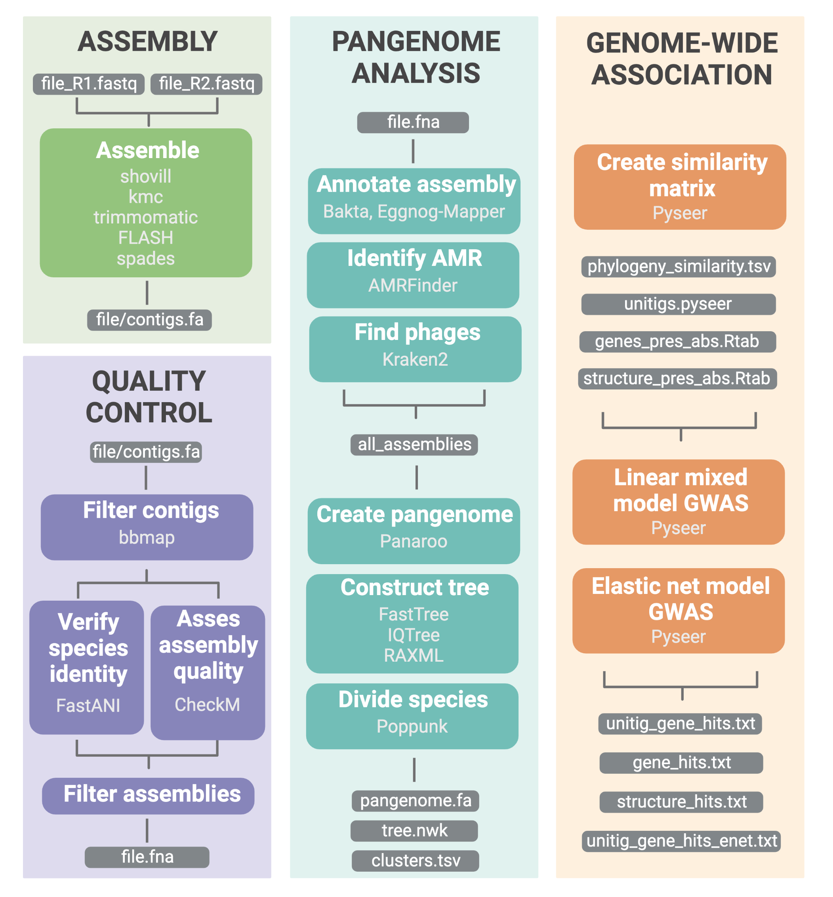

[](http://www.repostatus.org/#active)

# Panpiper

This package conducts bacterial isolate analysis for one species.  

* Assembly
    * Using [shovill](https://github.com/tseemann/shovill) the paired fastq files are assembled and sorted into ones which pass and fail assembly
* Quality control
    * The assemblies are analyzed with [CheckM](https://github.com/Ecogenomics/CheckM) and [FastANI](https://github.com/ParBLiSS/FastANI)
    * Based on user-defined thresholds the samples are sorted into ones which pass or don't pass requirements
* Pangenome analysis
    * A pangenome is created with the assemblies using [Panaroo](https://github.com/gtonkinhill/panaroo) and annotated with [AMRFinderPlus](https://github.com/ncbi/amr), [Bakta](https://github.com/oschwengers/bakta), [EggNOG-mapper](https://github.com/eggnogdb/eggnog-mapper), and [Kraken2](https://github.com/DerrickWood/kraken2)
    * The core genome alignment is used to create a phylogenetic tree with [FastTree](http://www.microbesonline.org/fasttree/), [RAxML](https://github.com/stamatak/standard-RAxML), and [IQ-TREE](https://github.com/Cibiv/IQ-TREE)
    * The samples are divided into phylogroups with [PopPUNK](https://github.com/bacpop/PopPUNK)
* Genome-wide association study
    * The pangenome is used with a continuous or binary phenotype to conduct a genome-wide association study with [Pyseer](https://github.com/mgalardini/pyseer)
    * The wrapper scripts used to analyze and filter the data are predominantly taken from the pyseer package.

Note: Be sure to cite all packages used in the pipeline. 

Credit: This package structure was inspired by the snakemake workflow [MAGinator](https://github.com/Russel88/MAGinator)



## Installation

Create package and install dependencies 

```sh
conda create -n panpiper -c bioconda -c conda-forge snakemake mamba
conda activate panpiper
pip install panpiper
```

Download databases

* The databses necessary will be downloaded automatically except in the case of Kraken2 and EggNOG-mapper. These databases have already been downloaded and are maintained in the package structure. In the case that you would like to use your own database, these databases can be downloaded into user-defined directories and can be referenced in the arguments as follows

```sh
panpiper ... --kraken_dir {directory} --eggnog_dir {directory} --bakta_dir {directory}
```

## Workflow

Note: The first time these functions are run, they will take a couple minutes before the workflow starts running because the conda dependendies need to be downloaded before start.

### Assembly: 
The fastq files should all be in a single directory. They need to be paired-end. 

```sh
panpiper -w assembly -o {output directory} -q {fastq directory} 
```

### Quality control: 
The fasta file directory should contain a subdirectory for each sample where the subdirectory name is the sample of the sample. The fasta file within these directories should be formatted as contigs.fa. This is the standard output from Shovill. The sample list should have one sample name per line which corresponds to the directory names. The reference fasta file should be the representative strain of the species which the samples will be compared to using average nucleotide identity.

```sh
panpiper -w quality -o {ouput directory} -a {fasta directory} -s  {sample list} -r {reference fasta file}
```

### Pangenome: 
The fasta file directory should contain a subdirectory for each sample where the subdirectory name is the sample of the sample. The fasta file within these directories should be formatted as contigs.fa. This is the standard output from Shovill. The sample list should have one sample name per line which corresponds to the directory names. The reference fasta file should be the representative strain of the species which the samples will be compared to using average nucleotide identity.

```sh
panpiper -w pangenome  -o {ouput directory} -a {fasta directory} -s  {sample list} -r {reference fasta file}
```

### Genome-wide association study: 
The gene and structure presence/absence files should be the result of Panaroo or Roary - from Panaroo this is the .RTab file. The unitig file is a result of unitig-caller; this file should be gzipped. The tree file can be any newick tree - if this pipeline has been followed to this point, we would recommend the tree file from iqtree. Finally, the reference file is a tab-delimited list of files to be used for unitig annotation. The format is file.fna file.gff2 {draft, ref}. 

```sh
panpiper -w pyseer  -o {ouput directory} -g {gene presence absence file} -p {structure presence absence file} -u {unitig file} -t {tree file from iqtree} -r {reference file}
```


### Run on a compute cluster
To run on a compute cluster, the cluster type needs to be specified (ie "slurm" below). In addition a "cluster.json" file must be provided which specifies details such as cluster.account, cluster.mem, etc. The example below is a qsub example. 

```sh
panpiper ... --cluster_type slurm --cluster_config cluster.json --cluster_args "sbatch -A {cluster.account} --mem {cluster.mem} -t {cluster.time} --cpus-per-task {cluster.cpus}"
```
    
